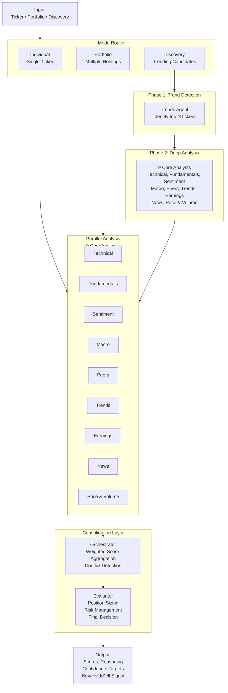

# folio-gauge

> A multi-agent stock analysis system powered by 11 specialist AI agents working in harmony to deliver comprehensive investment insights.

[](https://www.python.org/downloads/)
[](LICENSE)

## What is folio-gauge?

folio-gauge is a fully agentic stock analysis system that brings together **11 specialist AI agents** to analyze stocks from multiple perspectives:

- **9 core analysts**: technical, fundamentals, sentiment, macro, peers, trends, earnings, news, and price/volume
- **2 portfolio agents**: discovery (candidate identification) and portfolio management (rebalancing signals)
- **2 consolidation layers**: orchestrator (consensus builder) and evaluator (final decision maker)

Each agent is an expert in its domain, evaluates evidence independently, and contributes to a final investment recommendation backed by transparent reasoning.

**Perfect for**:
- Automated stock analysis and investment screening
- Portfolio rebalancing and opportunity identification
- Trend-following and discovery of emerging opportunities
- Integration with Claude Desktop via MCP
- Institutional and retail research workflows

---

## Key Features

- **Multi-Agent Reasoning** — 11 independent agents analyze different facets (technicals, fundamentals, sentiment, macro, etc.)
- **Consensus-Based Decisions** — Weighted voting system identifies conflicts and dissenting opinions
- **Transparency** — Every score includes reasoning, confidence levels, and data gaps
- **Three Operating Modes**:
  - **Individual** — Single ticker deep-dive with all 9 analysts
  - **Portfolio** — Batch analyze holdings with Buy/Hold/Trim recommendations
  - **Discovery** — Two-phase candidate identification from trending themes
- **Free Data Sources** — Uses yfinance, SEC EDGAR, Google Trends, StockTwits, Polymarket, FRED, and more
- **MCP Integration** — Works as a Claude Desktop plugin for conversational analysis
- **RAG-Powered Earnings Analysis** — Vector database integration for SEC filing synthesis
- **Domain Knowledge Driven** — Agents guided by expert-curated skills and prompts

---

## Quick Start

### Installation

**Using `uv` (recommended — faster):**
```bash
git clone https://github.com/yourusername/folio-gauge-mcp.git
cd folio-gauge-mcp
uv sync
cp .env.example .env
```

**Using `pip`:**
```bash
git clone https://github.com/yourusername/folio-gauge-mcp.git
cd folio-gauge-mcp
python3.12 -m venv venv
source venv/bin/activate  # On Windows: venv\Scripts\activate
pip install -e .
cp .env.example .env
```

### Configure API Keys

Edit `.env` and add your OpenAI API key:
```bash
OPENAI_API_KEY=sk-...your-key...
LANGSMITH_API_KEY=your-optional-key  # for tracing
FRED_API_KEY=your-fred-key  # for macro data
```

---

## Requirements

### API Keys (Required)

| Service | Purpose | Environment Variable | Sign Up |
|---------|---------|----------------------|---------|
| **OpenAI API** | GPT-4o/GPT-4o-mini LLM inference | `OPENAI_API_KEY` | [platform.openai.com](https://platform.openai.com/account/api-keys) |
| **LangSmith** (Optional) | Tracing & debugging | `LANGSMITH_API_KEY` | [smith.langchain.com](https://smith.langchain.com) |

Create a `.env` file from `.env.example`:
```bash
cp .env.example .env
# Edit .env and add your API keys
```

### System Requirements

```
Python 3.12.4 (or 3.11+, 3.13+)
8GB RAM (16GB recommended for Qdrant)
Docker (optional, for running Qdrant vector DB locally)
```

**Python Compatibility**:
- ✅ **3.12.4** (recommended, tested)
- ✅ **3.13.x** (should work)
- ✅ **3.11.x** (should work, slightly older)
- ⚠️ **3.10.x** (older, may have compatibility issues)

### Installation

**Option A: Using `uv` (faster, recommended)**

```bash
# Install uv if you don't have it
curl -LsSf https://astral.sh/uv/install.sh | sh

# Clone and install
git clone https://github.com/yourusername/folio-gauge-mcp.git
cd folio-gauge-mcp
uv sync 

```

**Option B: Using `pip`**

```bash
# Clone the repository
git clone https://github.com/yourusername/folio-gauge-mcp.git
cd folio-gauge-mcp

# Create virtual environment
python3.12 -m venv venv
source venv/bin/activate  # On Windows: venv\Scripts\activate

# Install dependencies
pip install -r requirements.txt

# Or for development
pip install -r requirements.txt
pip install -e ".[dev]"
```

### Core Dependencies

| Package | Purpose |
|---------|---------|
| `openai` | LLM inference (GPT-4, GPT-4o-mini) |
| `langgraph` | Agentic workflow orchestration |
| `langchain` | LLM integrations and tools |
| `yfinance` | Stock market data |
| `qdrant-client` | Vector database for earnings RAG |
| `mcp[cli]` | Model Context Protocol for Claude Desktop |
| `beautifulsoup4`, `feedparser` | Web scraping & RSS parsing |
| `httpx` | Async HTTP client |
| `pydantic` | Data validation |
| `python-dotenv` | Environment variable management |

See `requirements.txt` for the complete list.


---

## Usage

### Mode 1: Analyze a Single Stock

```python
from src.orchestrator.aggregator import orchestrate_analysis, format_orchestrator_summary
from src.orchestrator.evaluator import evaluate_consensus, format_evaluator_decision

# Run analysis
orchestrator_result = orchestrate_analysis("MSFT")
evaluator_decision = evaluate_consensus(orchestrator_result)

# Print results
print(format_orchestrator_summary(orchestrator_result))
print(format_evaluator_decision(evaluator_decision))
```

**Output includes**:
- All 9 analyst scores (1-5, BUY/HOLD/SELL, reasoning)
- Weighted consensus score
- Agent conflicts and dissenting opinions
- Position sizing and risk targets
- Confidence levels

### Mode 2: Analyze Your Portfolio

```python
import pandas as pd
from src.orchestrator.aggregator import orchestrate_analysis

# Load your portfolio
portfolio = pd.read_csv("data/portfolio.csv")
# Expected columns: symbol, qty, avg_cost, type

for _, holding in portfolio.iterrows():
    result = orchestrate_analysis(holding['symbol'])
    # Get Buy/Hold/Trim recommendations
```

### Mode 3: Discover New Candidates

```python
from src.analysts.trends import analyze_trends
from src.analysts.discovery import analyze_discovery

# Phase 1: Identify trending candidates
trends = analyze_trends("MARKET")  # Generic market scan

# Phase 2: Deep-dive on shortlist
for candidate in trending_list:
    result = orchestrate_analysis(candidate)
```

---

## Configuration

Edit `config.py` to customize:

```python
# Agent weights (must sum to 1.0)
AGENT_WEIGHTS = {
    "technical":    0.10,
    "fundamentals": 0.12,
    "sentiment":    0.09,
    # ... 8 more agents
    "portfolio":    0.14,  # Highest weight
}

# LLM models to use
LLM_MODEL_AGENTS = "gpt-4o-mini"       # Fast, cheap
LLM_MODEL_EVALUATOR = "gpt-4o"         # Strong reasoning

# Data source limits
TRENDING_STOCKS_COUNT = 5              # Top N trending tickers
FRED_CALLS_PER_MINUTE = 30             # FRED API rate limits
```

---

## Claude Desktop Integration (MCP)

folio-gauge works as an MCP (Model Context Protocol) server for Claude Desktop:

```bash
# 1. Install locally
pip install -e .

# 2. Start the server
folio-gauge

# 3. Configure Claude Desktop
# Edit ~/.claude/config.json:
{
  "mcpServers": {
    "folio-gauge": {
      "command": "folio-gauge"
    }
  }
}
```

Then ask Claude: *"Analyze AAPL and tell me if I should buy"* — it calls folio-gauge tools!

**Available tools**:
- `analyze_ticker(symbol)` — Single stock analysis
- `analyze_portfolio(symbols)` — Portfolio batch analysis
- `analyze_discovery()` — Find trending candidates
- `get_analyst_scores(symbol)` — Individual analyst breakdowns
- `get_orchestrator_consensus(symbol)` — Weighted aggregation only
- `get_sec_filing(symbol, filing_type)` — Fetch 10-K/10-Q/8-K

See [MCP_SERVER.md](MCP_SERVER.md) for detailed setup.

---

## Testing

Run the test suite to verify functionality:

```bash
# End-to-end orchestrator test (all 11 agents)
pytest tests/test_orchestrator_e2e.py -v

# Individual analyst tests
pytest tests/test_tool_*.py -v
pytest tests/test_analyst_*.py -v

# Operating mode tests (requires live data)
pytest tests/test_mode_individual.py -v
pytest tests/test_mode_portfolio.py -v
pytest tests/test_mode_discovery.py -v
```


---

## Documentation

More documents coming soon! For now, explore the codebase and check out the docstrings for each agent and function.

---

## How It Works

### The Analysis Pipeline



### The 11 Agents

**Core Analysts (analyzed in parallel for every ticker)**:

1. **Technical** — Price action, moving averages, RSI, MACD, breakouts
2. **Fundamentals** — P/E, P/B, ROE, margins, growth trends
3. **Sentiment** — Polymarket odds, StockTwits, retail conviction
4. **Macro** — Interest rates, inflation, GDP, employment
5. **Peers** — Relative valuation vs industry competitors
6. **Trends** — Google Trends, Reddit mentions, viral interest
7. **Earnings** — SEC filings, EPS growth, guidance, surprises
8. **News** — Recent headlines, catalysts, sentiment
9. **Price & Volume** — 52-week range, volume spikes, dividend yield

**Portfolio Agents** (used for discovery and portfolio analysis):

10. **Discovery** — Candidate screening and shortlisting
11. **Portfolio** — Risk, concentration, rebalancing signals

**Consolidation**:

12. **Orchestrator** — Aggregates scores, flags conflicts
13. **Evaluator** — Stress-tests decision, final call

---

## Learn More

- **LangGraph** — https://langchain-ai.github.io/langgraph/
- **OpenAI API** — https://platform.openai.com/docs/
- **MCP Protocol** — https://modelcontextprotocol.io/
- **yfinance** — https://github.com/ranaroussi/yfinance
- **FRED API** — https://fred.stlouisfed.org/docs/api/
- **StockTwits API** — https://stocktwits.com/
- **SEC EDGAR** — https://www.sec.gov/edgar.shtml
