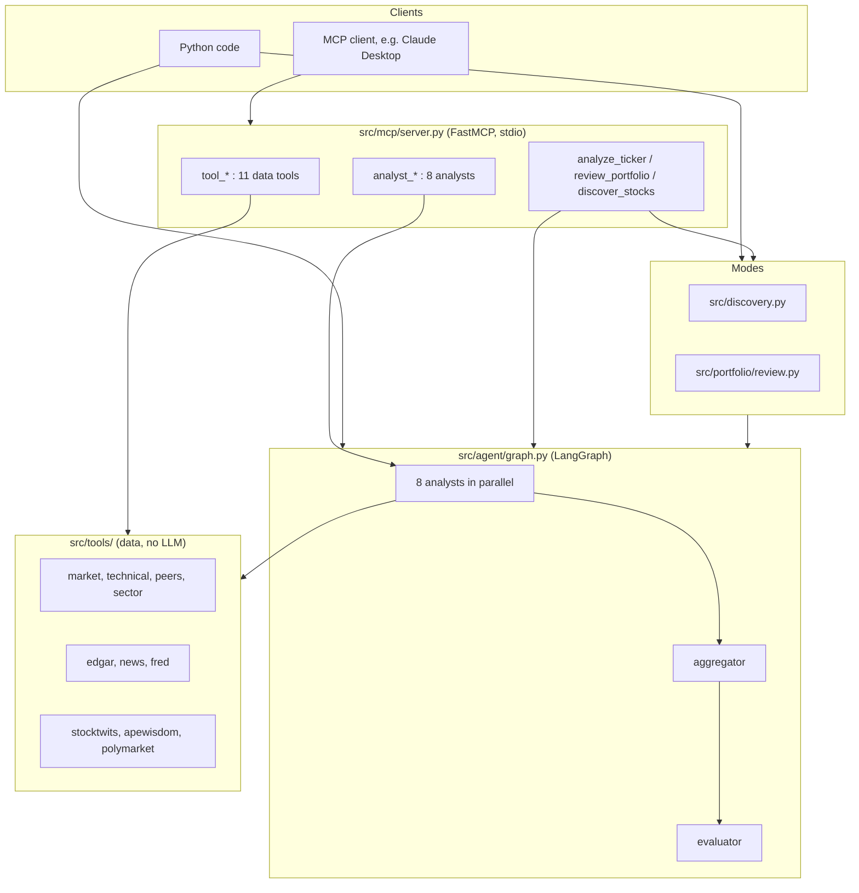
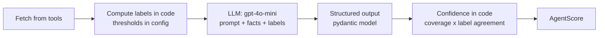
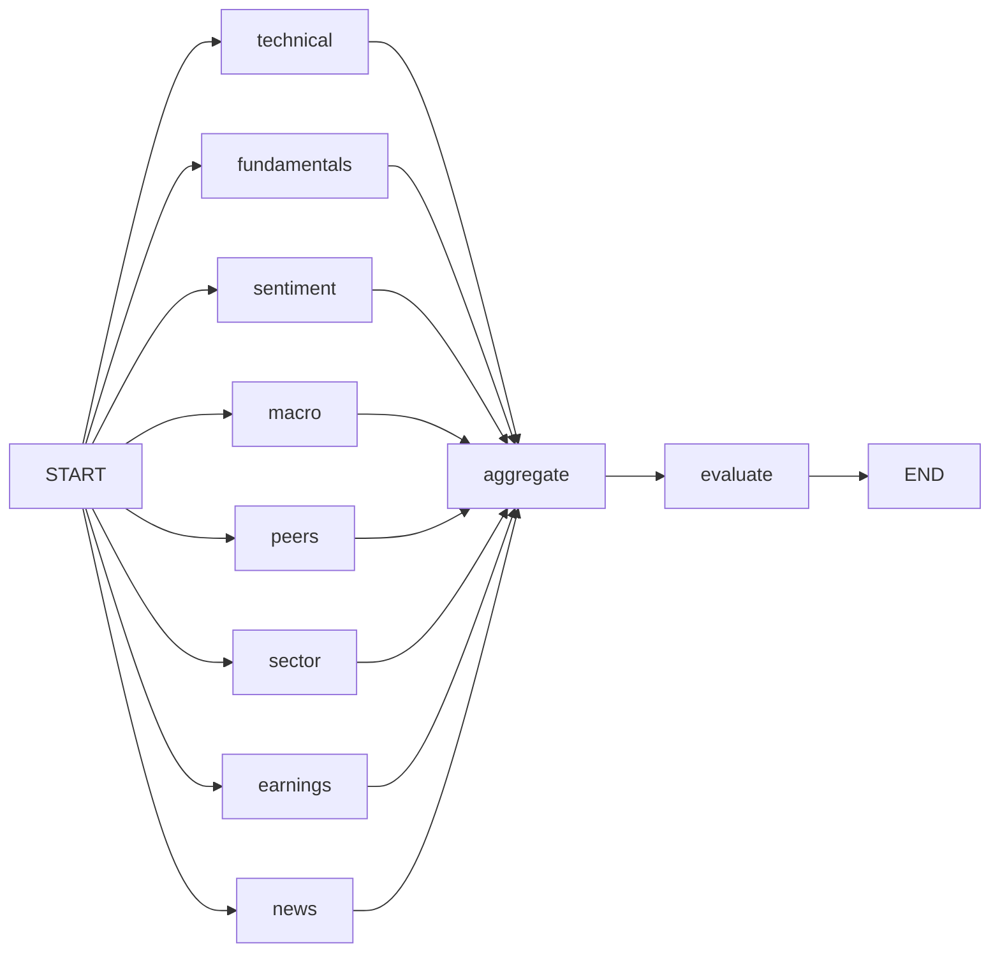

# folio-gauge Architecture

## 1. What the project is

folio-gauge is a multi-agent stock analysis system in Python 3.12. For a stock it gathers free market, filing, news, social and macro data. Eight specialist analysts score it, and their views are reconciled into a decision: BUY, HOLD or SELL, with a setup, a risk plan and an investment thesis.

It answers three questions:

| Question | Mode | Entry point |
|---|---|---|
| Should I buy, hold or sell this stock? | Ticker | `analyze_ticker(symbol)` |
| What should I do with each position in my portfolio? | Portfolio | `run_portfolio_review(holdings)` |
| Which trending stocks are worth researching? | Discovery | `run_discovery(limit)` |

It runs as a Python library or as an MCP server, so Claude Desktop (or any MCP client) can call its data sources, individual analysts or full workflows as tools.

**Stack:** LangGraph (pipeline), LangChain + OpenAI (gpt-4o-mini for analysts, gpt-4o for the evaluator, `text-embedding-3-small` for filings), pydantic (all data models), Qdrant in local mode (filing search), FastMCP (MCP server), yfinance, SEC EDGAR, FRED, RSS feeds, StockTwits, ApeWisdom, Polymarket.

## 2. Core idea: numbers in code, judgment in the model

Every number, and every label derived from numbers, is computed in Python with thresholds in `src/config.py`: a trend, a valuation band, a peer premium, a confidence, a decision, a position size. The language model receives those as **facts** and does what code can't: read text (filings, headlines, posts), weigh context (sector norms, one-time items, whether a premium is justified) and explain.

This came from evidence during the review. gpt-4o-mini misread numeric tables (it called a 30.9% ROE "higher" than a 42.6% median), and its self-reported confidence was always 0.75. Splitting the work makes every score traceable and testable.

## 3. System overview



### Layers

| Layer | Location | Responsibility | LLM? |
|---|---|---|---|
| Data tools | `src/tools/` | Fetch and normalize data; compute indicators | No (edgar uses embeddings) |
| Analysts | `src/analysts/` | Compute labels, ask the LLM for judgment, return an `AgentScore` | gpt-4o-mini, 1 call each |
| Aggregator | `src/orchestrator/aggregator.py` | Consensus per horizon, combine, minimum-confidence check | No |
| Evaluator | `src/orchestrator/evaluator.py` | Risk plan; investment thesis | gpt-4o, 1 call |
| Pipeline | `src/agent/graph.py`, `state.py` | LangGraph wiring, parallelism, failure isolation, batches | No |
| Modes | `src/discovery.py`, `src/portfolio/` | Candidate ranking, portfolio facts and actions, reviews | gpt-4o-mini, 1 call each |
| Interface | `src/mcp/server.py` | MCP tools over stdio | No |
| Shared | `src/agent/scoring.py`, `knowledge.py`, `src/utils/`, `src/config.py` | Models, prompt loading, HTTP, logging, configuration | No |

## 4. Directory structure

```
src/
  config.py               all thresholds, weights, models; loads .env
  agent/
    graph.py              LangGraph pipeline; analyze_ticker, analyze_tickers
    state.py              TickerState (LangGraph state schema)
    scoring.py            AgentScore, HorizonConsensus, OrchestratorResult, decision_from_score, compute_confidence
    knowledge.py          load_prompt(agent) -> prompts/<agent>.md
  tools/                  one module per data source (section 5)
  analysts/               one module per analyst (section 6)
  orchestrator/
    aggregator.py         two-horizon consensus (code)
    evaluator.py          risk plan (code) + thesis (gpt-4o)
  discovery.py            discovery mode
  portfolio/
    models.py             Holding
    loader.py             load_portfolio_csv
    review.py             portfolio facts, actions, review
  mcp/server.py           MCP server
  utils/
    http.py               shared httpx client (named User-Agent) + retry on 429/5xx/network
    logger.py             logging to stderr
prompts/                  one system prompt per agent (8 analysts, evaluator, discovery, portfolio)
tests/                    unit tests (pytest) and live smoke scripts
docs/                     this file, REVIEW_SUMMARY.md, CHANGELOG.md
data/qdrant/              local vector index for SEC filings (gitignored)
```

## 5. Data tools (`src/tools/`)

Each module fetches from one source and returns pydantic models. No LLM calls (apart from edgar's embeddings) and no scoring.

| Module | Source | Main function -> model | Notes |
|---|---|---|---|
| `market.py` | yfinance `info` | `get_ticker_snapshot` -> `TickerSnapshot` (profile, price, fundamentals, analyst targets) | Units normalized: ratios as fractions; D/E and dividend yield divided by 100 |
| `technical.py` | yfinance 2y daily history | `get_technical_snapshot` -> `TechnicalSnapshot` | SMA 50/200, RSI 14, MACD, 1/3/6m returns, 52-week range, volume balance, relative volume, ATR 14; `None` when history is too short |
| `peers.py` | yfinance Industry/Sector | `compare_to_peers` -> `PeerComparison` | Up to 5 industry peers (sector fill-in for dominant companies), medians, valuation premiums; retries empty Yahoo responses |
| `sector.py` | yfinance download | `get_sector_trend` -> `SectorTrend` | Stock vs SPDR sector ETF vs SPY, excess returns |
| `edgar.py` | SEC EDGAR | `get_company_filings`, `get_earnings_facts` (XBRL), `ingest_filings`, `query_filings` | Embeds the MD&A (10-K/10-Q) and earnings press releases (8-K Exhibit 99.1) into local Qdrant; financials from XBRL frames, looked up by period |
| `news.py` | Yahoo Finance, Google News, Seeking Alpha RSS | `get_ticker_news` -> `NewsFeed` | 14 days, deduplicated by URL and title, option-quote pages dropped, max 25; failing feeds listed |
| `fred.py` | FRED | `get_macro_snapshot` -> `MacroSnapshot` | Fed funds, CPI YoY (by calendar month), unemployment + Sahm indicator, GDP, yield curve, VIX; cached per day |
| `stocktwits.py` | StockTwits | `fetch_stocktwits_sentiment`, `fetch_stocktwits_trending` | Bullish/bearish tag counts and post texts |
| `apewisdom.py` | ApeWisdom | `fetch_mentions`, `fetch_top` | Mention rank and 24h counts on stock discussion forums (no Reddit API) |
| `polymarket.py` | Polymarket gamma API | `fetch_polymarket_markets` | Open markets only; price bets (any `$` price level, "Up or Down") and placeholders dropped |

## 6. Analysts (`src/analysts/`)

Every analyst follows the same pattern:



`AgentScore` holds: agent, symbol, decision (from the score), score 1-5, timeframe, reasoning, confidence 0-1 and data_gaps. Field constraints validate it on construction.

| Analyst | Horizon | Labels computed in code | LLM's job |
|---|---|---|---|
| technical | short | trend (price vs SMA 50 and 200), momentum (MACD and return votes), volume (balance), RSI zone | judge confirmation, divergence, stretch |
| sentiment | short | tagged sentiment (net bull/bear share, min 5 tags), attention (ApeWisdom 24h change) | read post tone (`text_tone`); weigh attention and Polymarket |
| news | short | net sentiment (high materiality counts double), **score** | label each article: relevant, sentiment, materiality; summarize |
| sector | short | sector vs market, stock vs sector (3 and 6-month excess returns) | judge the combination |
| fundamentals | long | valuation, profitability, financial health (rule votes) | weigh in the sector's context |
| earnings | long | EPS trend, quarterly momentum, cash conversion | read guidance and one-time items from filing passages |
| peers | long | relative valuation (median premium), relative quality | judge whether a premium is justified |
| macro | long | rates, inflation, labor (Sahm), growth, yield curve, volatility | judge the impact on the stock's sector |

**Confidence** (`scoring.compute_confidence`) = `coverage x (0.5 + 0.5 x agreement)`. Coverage is the share of data available. Agreement compares the analyst's own labels mapped to -1/0/+1: 1 if identical, 0.5 one step apart, 0 if opposed.

**News is the exception:** after the LLM labels each article, the score is pure arithmetic, so no second call is needed.

**Missing data** gives a neutral score of 3 with low confidence, never a bearish default.

## 7. The ticker pipeline (`src/agent/graph.py`)



- **State** (`TickerState`): `symbol`, `scores` (an append reducer, so the parallel nodes each add one score), `consensus`, `decision`. LangGraph keeps only declared keys, so every key a node writes must be in the schema.
- **Parallelism:** LangGraph runs the 8 analyst nodes in the same step on worker threads. A ticker takes about 11-15s, roughly the slowest analyst plus the evaluator.
- **Failure isolation:** a failing analyst node logs its stack trace and records a neutral score with confidence 0, so it carries no weight.
- **Batches:** `analyze_tickers(symbols)` runs `config.ANALYSIS_WORKERS` (3) tickers at a time. A failing ticker is reported in `failed` while the rest continue.

## 8. Consensus and decision (`src/orchestrator/`)

### 8.1 Two horizons

The analysts are grouped into two horizons (`config.HORIZONS`) because price and business signals often disagree. A single average hid that and returned HOLD for most stocks.

| Horizon | Analysts | Question |
|---|---|---|
| short | technical, sentiment, news, sector | What are price and news flow saying (days to months)? |
| long | fundamentals, earnings, peers, macro | What do the business and valuation say (months to years)? |

Per horizon (`aggregator.horizon_consensus`):

```
effective weight_i = AGENT_WEIGHTS[agent_i] x confidence_i
weighted score     = sum(w_i x score_i) / sum(w_i)
agreement          = 1 - weighted std of scores / 2        (scores 1-5, std at most 2)
confidence         = mean confidence (by AGENT_WEIGHTS) x agreement
decision           = BUY if score >= 3.5, SELL if < 2.5, else HOLD
```

`AGENT_WEIGHTS`: fundamentals 0.17, earnings 0.15, technical 0.13, news 0.12, peers 0.12, sector 0.11, sentiment 0.10, macro 0.10.

### 8.2 Combining horizons (`aggregator.combine`)

| Long \ Short | BUY | HOLD | SELL |
|---|---|---|---|
| **BUY** | BUY, aligned | BUY, long_term | BUY, accumulate |
| **HOLD** | BUY, trade | HOLD, none | HOLD, none |
| **SELL** | BUY, trade | SELL, long_term | SELL, aligned |

The **leading horizon** is short for a trade and long otherwise. If its confidence is below `HORIZON_MIN_CONFIDENCE` (0.4), the BUY/SELL is **held for low confidence** and becomes HOLD. The setup is kept, to explain why.

### 8.3 Risk plan and thesis (`evaluator.py`)

The plan is computed in code; positions are opened only for BUY:

| Setup | Size (of portfolio) | Stop-loss | Take-profit |
|---|---|---|---|
| aligned, long_term | 10% x confidence | price - 2 x ATR(14) | 2 x stop distance above price |
| accumulate | half of that, a **starter position**, stated explicitly | price - 2 x ATR | 2:1 |
| trade | half of that | price - **1.5** x ATR (tighter) | 2:1 |

Size is cut by 30% when the VIX is above 25 (live from FRED). gpt-4o then writes the thesis, key considerations and risks from the two horizons, every analyst's reasoning, the conflicts and the data gaps. It cannot change the decision or the numbers.

**Output:** `TickerAnalysis(consensus: OrchestratorResult, decision: EvaluatorDecision)`.

## 9. Modes

### Portfolio review (`src/portfolio/review.py`)

1. **Input:** holdings `(symbol, qty, avg_cost, long|short)` from a list or a CSV (`loader.py`).
2. Every holding is analyzed (`analyze_tickers`).
3. **Facts in code:** market value (negative for shorts), weight of gross exposure, unrealized P&L, net exposure, top weight, Herfindahl index, sector weights, and concentration flags (position over 20%, sector over 40%).
4. **Actions in code** (`position_action`), from the consensus decision, confidence and concentration. Shorts are mirrored. **Unrealized P&L is deliberately not an input.**
   - BUY: add, or hold if concentrated or confidence is low.
   - HOLD: hold, or trim if concentrated.
   - SELL: exit with confidence of at least 0.7, else trim.
5. The LLM writes the summary, the risks and one reason per action. Output: `PortfolioReport`.

### Discovery (`src/discovery.py`)

1. **Candidates in code** (`find_candidates`, no LLM): ApeWisdom's most-mentioned 25 plus StockTwits trending. Ranked by being on both sources, then mention growth, then mentions. Only common stocks are kept (yfinance `quoteType == EQUITY`).
2. Each candidate is analyzed (`analyze_tickers`).
3. The LLM compares them: research_further / watch / skip, with reasons.
4. Output: `DiscoveryReport`, with compact per-candidate results.

## 10. MCP server (`src/mcp/server.py`)

FastMCP over stdio. Input schemas come from type hints, descriptions from docstrings, and pydantic return types give structured output. Blocking work runs in a thread (`anyio.to_thread`). A failure logs its stack trace to stderr and returns a tool error to the client.

| Level | Tools |
|---|---|
| Data (no LLM) | `tool_market`, `tool_technical`, `tool_peers`, `tool_sector`, `tool_edgar`, `tool_edgar_search`, `tool_news`, `tool_fred`, `tool_stocktwits`, `tool_apewisdom`, `tool_polymarket` |
| Analysts | `analyst_technical`, `analyst_fundamentals`, `analyst_peers`, `analyst_sector`, `analyst_earnings`, `analyst_news`, `analyst_sentiment`, `analyst_macro` |
| Workflows | `analyze_ticker`, `review_portfolio` (holdings or `csv_path`), `discover_stocks` (`limit`, default 10) |

Run: `uv run --directory <repo> python -m src.mcp.server`. Setup for Claude Desktop and the MCP Inspector is in the README.

## 11. Cross-cutting design

| Concern | Approach |
|---|---|
| **Errors** | Never swallowed: every caught failure is logged with its stack trace (`logger.exception`). Single-source analysts raise, and the graph records a zero-weight score. Multi-source analysts (sentiment, news feeds) record a data gap and continue. Batches report failed tickers. |
| **Logging** | To stderr. stdout carries the MCP protocol. |
| **HTTP** | One shared `httpx.Client` with a named User-Agent (Yahoo rejects the default). Retries only 429, 5xx and network errors, 3 attempts with backoff. Yahoo's empty responses through yfinance are retried in `peers.py`. |
| **LLM output** | `with_structured_output(PydanticModel)`; no hand-parsed JSON. Prompts in `prompts/<agent>.md` describe the facts and the judgment; the output format lives in the model. |
| **Concurrency** | LangGraph threads for analysts; a thread pool for batches. Local Qdrant uses SQLite, so its connection allows cross-thread use and every Qdrant call holds a lock (SQLite allows sharing as long as calls never overlap). |
| **Caching** | The FRED snapshot is cached per day. Filings are embedded once per filing (skipped if stored, superseded ones pruned). |
| **Configuration** | Every threshold, weight, band and model is in `src/config.py`, which also loads `.env`. |

## 12. Configuration and secrets

| Variable | Used by |
|---|---|
| `OPENAI_API_KEY` | chat models and embeddings, unless `LLM_*` / `EMBEDDING_*` point elsewhere |
| `LLM_BASE_URL`, `LLM_API_KEY` | optional; OpenAI-compatible provider for the chat models (`utils/llm.py`) |
| `LLM_MODEL_AGENTS`, `LLM_MODEL_EVALUATOR` | optional; default `gpt-4o-mini`, `gpt-4o` |
| `EMBEDDING_BASE_URL`, `EMBEDDING_API_KEY`, `EMBEDDING_MODEL`, `EMBEDDING_DIMENSION` | optional; filing embeddings (`tools/edgar.py`), default the `LLM_*` provider; one Qdrant collection per model |
| `FRED_API_KEY` | `tools/fred.py` |
| `EDGAR_USER_AGENT` | `tools/edgar.py` (SEC requires a contact, e.g. "folio-gauge you@example.com") |
| `QDRANT_PATH` | optional; local Qdrant directory (default `data/qdrant`) |
| `LANGSMITH_*` | optional tracing (LangChain picks them up) |

No keys are needed for yfinance, SEC EDGAR, RSS feeds, StockTwits, ApeWisdom or Polymarket.

## 13. Testing

| Kind | Files | Run |
|---|---|---|
| Unit (no network) | `test_config.py`, `test_aggregator.py`, `test_evaluator.py` | `uv run pytest` |
| Data tools (live) | `test_tool_<name>.py` | `uv run python -m tests.test_tool_<name> [TICKER]` |
| Analysts (live) | `test_analyst_<name>.py` | `uv run python -m tests.test_analyst_<name> [TICKER]` |
| Pipeline / modes | `test_orchestrator.py`, `test_portfolio_review.py`, `test_discovery.py` | `uv run python -m tests.<name>` (`--analyze` for the full analysis) |
| MCP | `test_mcp_server.py` | `uv run python -m tests.test_mcp_server [TICKER] [--full]` |

The unit tests cover the configuration invariants, the consensus math, all 9 cells of the combination table, the minimum-confidence check and each risk plan. The live smoke scripts print the data and PASS/FAIL/WARN checks.

## 14. Extending

**Add a data source:** create `src/tools/<name>.py` with pydantic models and use `utils.http.get_json`/`get_text`. Add a `tool_<name>` in `server.py` and a `tests/test_tool_<name>.py`.

**Add an analyst:**
1. Create `src/analysts/<name>.py`:
   - fetch from tools
   - compute labels with thresholds in `config.py`
   - get structured output from the LLM (score and text judgment only)
   - compute confidence with `compute_confidence`
   - return an `AgentScore`
2. Add `prompts/<name>.md`.
3. Register it in `analysts/__init__.py` and `graph.ANALYSTS`, add a weight to `AGENT_WEIGHTS` (keep the sum at 1.0) and a place in `HORIZONS`. `test_config.py` enforces all three.
4. Add an `analyst_<name>` MCP tool and a smoke test.

**Change a rule:** adjust the threshold in `config.py`. Every rule is documented where it is applied (module docstrings) and summarized in this file.

## 15. Known limitations

- **Free data sources:** StockTwits and Yahoo occasionally block requests (403/401), which reduces coverage for that run. Some yfinance data for foreign listings is wrong.
- **Foreign filers** (20-F, IFRS) have no SEC XBRL data, so earnings is neutral with data gaps.
- **ApeWisdom** is a rolling 24h list; tickers drop in and out.
- **Run-to-run variation:** analysts run at temperature 0.3, so a horizon score near a cut-off can flip a decision.
- **No backtesting:** thresholds, weights and setups are reasoned defaults, not fitted to historical returns.
- **Not investment advice:** outputs are research aids.

See `docs/REVIEW_SUMMARY.md` for the review's findings and `docs/CHANGELOG.md` for the history of each design decision.
